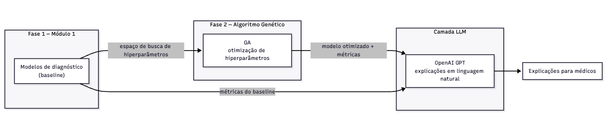
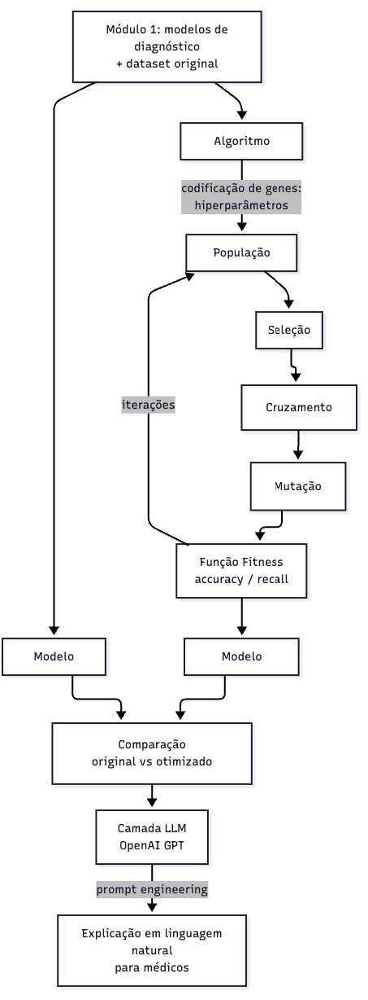

# Arquitetura

## Visão geral dos componentes

## Visão geral do fluxo

## Componentes

- **Módulo 1 (entrada):** dataset Breast Cancer Wisconsin (`data/raw/data.csv`, 569
  amostras, 30 features) e os 5 modelos originais (SVC Linear, Linear Regression,
  Decision Tree, Logistic Regression, KNN), portados em `src/models/baseline.py`.
  Melhor modelo original: Logistic Regression (acc 0.9737, recall 0.9767).
- **Algoritmo Genético (`src/ga/`):** codifica hiperparâmetros como genes, aplica seleção,
  cruzamento e mutação, e avalia cada indivíduo via função fitness (accuracy, recall, F1).
- **Comparação:** compara métricas do modelo original vs. otimizado, ao longo de 3+
  experimentos com configurações distintas do GA.
- **Camada LLM (`src/llm/`):** recebe os resultados numéricos e gera explicações em
  linguagem natural via API da OpenAI (prompt engineering). **PENDENTE PARCIAL**
- **Observabilidade:** logging dos experimentos do GA e monitoramento em produção via
  Azure Monitor / Application Insights. **PENDENTE**
- **Infraestrutura (`infra/azure/`):** IaC para deploy com escalabilidade automática no
  Azure (Azure Container Apps). **PENDENTE**
