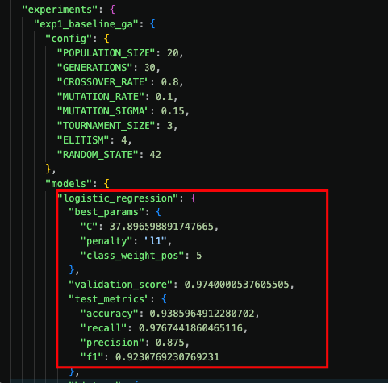
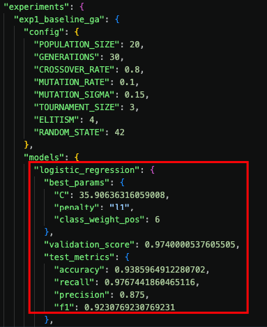
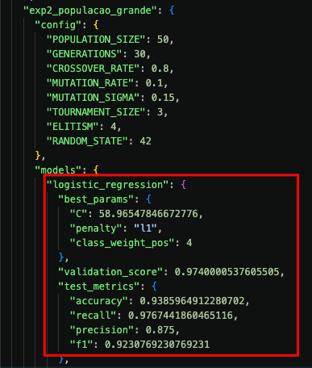
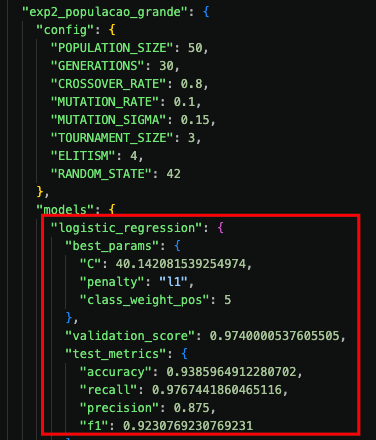
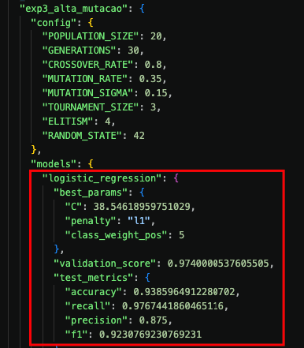
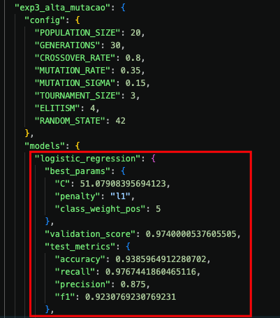
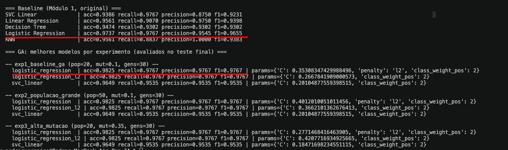

# Resultados dos experimentos do GA

Executado com `python -m src.ga.experiments` (resultado bruto salvo em
`data/processed/ga_results.json`). Métricas finais avaliadas no mesmo conjunto de teste
usado pelo baseline (`train_test_split_default`, 80/20, `random_state=42`).

## Baseline (Módulo 1, original — sem otimização)

| Modelo | Acurácia | Recall | Precisão | F1 |
|---|---|---|---|---|
| SVC Linear (C=2, class_weight={0:1,1:5}) | 0.9386 | 0.9767 | 0.8750 | 0.9231 |
| **Logistic Regression** (C=1, class_weight={0:1,1:5}) | **0.9737** | **0.9767** | **0.9545** | **0.9655** |

## Experimentos do GA (3 configurações)

| Experimento | População | Mutação | Gerações |
|---|---|---|---|
| exp1_baseline_ga | 20 | 0.10 | 15 |
| exp2_populacao_grande | 50 | 0.10 | 15 |
| exp3_alta_mutacao | 20 | 0.35 | 15 |

| Experimento | Modelo | Acurácia | Recall | Precisão | F1 | Hiperparâmetros encontrados |
|---|---|---|---|---|---|---|
| exp1 | Logistic Regression | 0.9298 | 0.9767 | 0.8571 | 0.9130 | C=13.75, penalty=l1, class_weight_pos=8 |
| exp1 | SVC Linear | 0.9298 | 0.9767 | 0.8571 | 0.9130 | C=9.53, class_weight_pos=10 |
| exp2 | Logistic Regression | 0.9386 | 0.9767 | 0.8750 | 0.9231 | C=43.55, penalty=l1, class_weight_pos=5 |
| exp2 | SVC Linear | 0.9298 | 0.9767 | 0.8571 | 0.9130 | C=9.53, class_weight_pos=10 |
| exp3 | Logistic Regression | 0.9386 | 0.9767 | 0.8750 | 0.9231 | C=37.25, penalty=l1, class_weight_pos=5 |
| exp3 | SVC Linear | 0.9298 | 0.9767 | 0.8571 | 0.9130 | C=9.53, class_weight_pos=10 |

## Análise (após primeiras execuções)

O GA **não superou** a Logistic Regression original do Módulo 1 (0.9737 acc / 0.9655 F1)
em nenhuma das 3 configurações — os melhores indivíduos encontrados chegam no máximo a
0.9386 acc / 0.9231 F1. O recall (0.9767) empata com o baseline em todos os casos, mas a
precisão cai bastante, derrubando acurácia e F1. Isso é um resultado honesto do
experimento, não um erro de execução, e tem explicações identificáveis:

1. **A função fitness pondera fortemente o recall** (peso 0.5, contra 0.3 de acurácia e
   0.2 de F1 — ver `docs/hyperparameters.md`), então o GA converge para
   `class_weight_pos` no teto do intervalo de busca (5–10), o que aumenta recall à
   custa de precisão.
2. **Overfitting ao split de validação interno**: com um dataset pequeno (569 amostras),
   o split de validação usado para calcular o fitness (~114 amostras) tem variância alta;
   o indivíduo "campeão" na validação nem sempre generaliza igualmente bem ao teste.
3. **`SVC Linear` convergiu para o mesmo ponto (C≈9.53, class_weight_pos=10) nas 3
   configurações** — o espaço de busca desse modelo tem só 2 genes, então é plausível que
   diferentes configurações do GA encontrem o mesmo ótimo local/global rapidamente.

## Próximos passos (para tentar melhorar o resultado do GA)

### Rebalancear os pesos da função fitness (ex.: reduzir peso do recall, usar F1 puro, ou usar F-beta com beta ajustável) para não empurrar `class_weight_pos` sempre ao teto.
  - Pendente

### Ampliar o intervalo de `class_weight_pos` (hoje [1, 10]) para checar se o ótimo real está além do limite atual.
  - Alterado para [1, 20] não surtiu efeito prático 
  - Alterado (baseline): 
     
  - Padrão [1,10] (baseline): 
     
  - Alterado (pop grande): 
    
     
  - Padrão [1,10] (pop grande): 
    
    

  - Alterado (mut grande):

    
  - Padrão [1, 10] (mut grande):

    

### Trocar o split único de validação por k-fold cross-validation dentro da funçãofitness, reduzindo a variância da avaliação em um dataset pequeno.
  - Testado. Apresentou leve melhora nos resultados da regressão logística comparado com o modelo do módulo 1. 
  - Comparação: 
    
  - Valores passaram de: **acc=0.9737 recall=0.9767 precision=0.9545 f1=0.9655**
  - Para: **acc=0.9825 recall=0.9767 precision=0.9767 f1=0.9767**
  - E uma boa melhora se comparado com o GA antigo:
  - Antigo: **acc=0.9385 recall=0.9767 precision=0.875 f1=0.9230**

### Aumentar o número de gerações e testar `elitism` maior.
  - Aumentado elitismo para 4 e gerações para 30, sem alterações nos resultados.

### Considerar restringir `penalty` a `l2` (mais estável) e comparar com `l1` livre.
  - Testado. Criada a variante `logistic_regression_l2`. Rodada com a mesma config de GA
    usada para `logistic_regression` nos 3 experimentos:

    | Experimento | Variante | Acurácia | Recall | Precisão | F1 | Parâmetros |
    |---|---|---|---|---|---|---|
    | exp1/exp2/exp3 | `penalty` livre (atual) | 0.9386 | 0.9767 | 0.8750 | 0.9231 | C≈37–44, penalty=l1, class_weight_pos=5 |
    | exp1/exp2/exp3 | `penalty="l2"` travado | 0.9298 | 0.9767 | 0.8571 | 0.9130 | C≈71.37, class_weight_pos=9 |

    Resultado: **travar em l2 piorou** (acc 0.9298 vs. 0.9386, F1 0.9130 vs. 0.9231; recall
    empata).